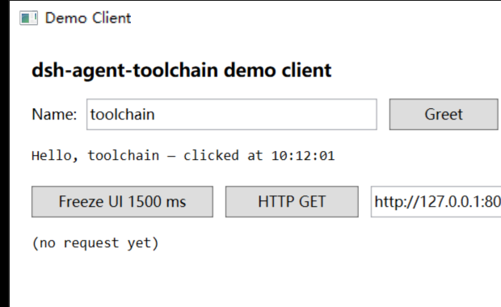

# dsh-agent-toolchain

**The engineering runtime that makes coding agents *verifiably accountable* for their own changes.**

[](https://github.com/lemonmmice/dsh-agent-toolchain/actions/workflows/ci.yml)
[](./LICENSE)
[](https://github.com/lemonmmice/dsh-agent-toolchain/releases)
[](https://nodejs.org)
[](./mcp/README.md)

A suite of plugins and an MCP server that let a coding agent do more than write code — it can *see* the running desktop application, *drive* it, *measure* it, *capture* what it sends over the network, and *verify* the change it just made. Each plugin is a small, composable building block; together they close the loop between "the agent wrote a change" and "the change actually works" — and produce the evidence to prove it.



One command runs the whole loop against a throwaway WPF window that ships in this repo — build it, drive it, read the result back out, then have `verify_report` adjudicate what the run claimed:

```bash
npm run demo          # build → launch → drive → read → verdict
npm run demo:perf     # + catch a deliberately blocked UI thread
```

Real output (`npm run demo`, paths shortened):

```
1. environment self-check
  ok   toolchain_status reports what is configured        (toolchain_status, 542 ms)
2. build the sample app (and bind the result to a runId)
  ok   build_run → 0 errors                               (build_run, 3353 ms)
3. launch and look at the real window
  ok   ui_launch brings the window up                     (ui_launch, 11929 ms)
  ok   ui_observe(state) sees the controls                (ui_observe, 62 ms)
4. drive it — this is the part a code-reading agent cannot do
  ok   type into the Input box                            (ui_drive, 458 ms)
  ok   click Greet                                        (ui_drive, 314 ms)
  ok   read the result back out of the UI                 (ui_observe, 79 ms)
  ok   capture a screenshot as evidence                   (ui_observe, 35 ms)
5. adjudicate: claims vs evidence
  ok   verify_report returns a verdict                    (verify_report, 57 ms)

verdict: pass
steps: 9/9 ok
```

`npm run demo:perf` additionally reports `stutterCount=1, maxMs=1474` — the sample app blocks its UI thread for exactly 1500 ms on purpose, and the perf probe has to catch it.

> The demo is not demo-only code. `mcp/demo/run-demo.mjs` is an ordinary MCP client: it spawns `mcp/server.mjs` over stdio and calls the same tools Claude Code, Cursor, Cline or Codex would call. If it passes, the MCP face works.

> Recording a GIF: `npm run demo:perf` while a screen recorder is running is the intended capture — the window does something visible at every step. `docs/media/` is where the recording goes.

## The problem

Coding agents are excellent at producing patches, but they are blind to what happens after the patch: Did the build break? Did the UI actually render the new page? Which API calls did the application fire, and did one of them hang for 20 seconds? Did the change introduce a memory leak or a UI stall?

Traditional agents verify by reading code. This toolchain lets them verify by *observing the running application* — the same way a human QA engineer would — and then makes them show the evidence.

## The loop

```
  change code → build (dsh-build) → drive client (dsh-ui-drive)
                                      → capture APIs (dsh-api-visualizer, dsh-postman)
                                      → inspect perf (dsh-perf) / hang (dsh-hang-inspector)
                                      → remember lessons (dsh-memory)
  claim "done" → verify_report: claims vs evidence → one verdict
  fail / handoff → failure_record → failure corpus (the data flywheel)
```

## Quick start

### Path A — the demo path (no Rust, about five minutes)

Exactly the tools `npm run demo` exercises — `build_run`, the `ui_*` family, `verify_report`, `perf_probe`, `http_request` — need **neither Rust nor MSVC**. Verified on a checkout whose `plugins/*/bin/` directories are empty.

1. Node.js 20+ and a .NET SDK (the sample targets `net10.0-windows`).
2. `npm install --prefix mcp` — the MCP server is the only thing with a dependency.
3. `npm run demo`.

Nothing is written into the repo tree: a demo run keeps its screenshots, build log, verify report and any failure records under `.dsh-agent-toolchain/demo/` (gitignored).

### Path B — full desktop mode

The API-capture store, the memory index, flame folding and the terminal inspector load Rust Node-API modules. Build the ones you need (Rust + Visual C++ build tools), or take a deployment that already ships them:

```bash
npm run build:capture-store        # dsh-api-visualizer (+ shared by dsh-verify)
npm run build:memory-store         # dsh-memory
npm run build:trace-fold           # dsh-perf flame folding
npm run build:terminal-inspector   # dsh-win-terminal-inspector
```

Then `pwsh -File install.ps1` (dry run) or `pwsh -File install.ps1 -Apply` to copy the plugins into your DSH profile, register them in `cordis.patch.yml`, and restart the host.

## What this does that a code-reading agent cannot

- **Tell the difference between "0 errors" and "the file was compiled".** Legacy `.csproj` projects do not include new `.cs` files automatically, so a build can report success while your file was never compiled. `build_compile_check` answers that question specifically, with three states — in the compilation set, provably not, or *cannot be read* (never silently "not").
- **Operate and observe the real application.** `ui_observe` / `ui_drive` / `ui_flow` find controls by name or AutomationId, click, type, wait for conditions, read values back, and capture window-scoped screenshots. Read-only actions never need permission; anything that clicks or types must pass `allowSideEffects=true`, and an optional snapshot-freshness gate rejects actions aimed at a stale UI.
- **Refuse to take the agent's word for it.** A closing summary becomes a claims list, and `verify_report` adjudicates each claim against machine evidence — a build record, the API capture store, a file on disk, a real command, git state — producing `pass` / `incomplete` / `fail`. Claims that the evidence contradicts are recorded in the failure corpus (class `agent-misjudge`) automatically. When the tools cannot see something, they say "unverified", not "passed".

## Tools — 54, of which 23 are read-only

The single source of truth is [`lib/tool-registry.mjs`](./lib/tool-registry.mjs); both faces (DSH plugins and MCP) are generated from it, so they cannot drift apart. **Every tool, one line each, sorted by what you are trying to do → [docs/tools.md](./docs/tools.md).**

| Plugin | What it does for the agent |
| --- | --- |
| [dsh-build](./plugins/dsh-build/README.md) | Run MSBuild / `dotnet build` as a tool: incremental build, structured error list (file/line/col/code), error re-parse, compile-membership check. Build defaults auto-resolve by repo layout (legacy client layouts keep their defaults byte-for-byte; stock repos get `.sln`/`.slnx` + platform auto-detection). |
| [dsh-ui-drive](./plugins/dsh-ui-drive/README.md) | Drive a running Windows desktop client via UIA: find/click/type/read/screenshot, visual-tree dumps, multi-step flows with assertions, screenshot + vision description. |
| [dsh-verify](./plugins/dsh-verify/README.md) | The closing-adjudication surface: claims vs evidence verdicts, plus the failure corpus tools. Thin shell over `lib/verify` — the same engine behind the MCP `verify_report`. |
| [dsh-api-visualizer](./plugins/dsh-api-visualizer/README.md) | Capture the client's HTTP traffic: live panel, JSONL store, caller attribution, auto-responder rules, baseline/contract regression, optional Fiddler-style local proxy. |
| [dsh-postman](./plugins/dsh-postman/README.md) | Postman-style HTTP client inside the harness: compose/send requests from the host (no browser CORS), history store, WebSocket client, `http_request` agent tool. |
| [dsh-perf](./plugins/dsh-perf/README.md) | UI stutter measurement (window-message latency, P50/P95/P99, stutter events), full-dump capture + ClrMD analysis, managed-heap stats, GC-root retention paths, ETW trace / hotstacks / flame and allocation folding, UI-freeze (wall-clock) analysis. |
| [dsh-hang-inspector](./plugins/dsh-hang-inspector/README.md) | Hang diagnosis: monitor main-window responsiveness, auto-collect evidence packs (frozen screenshot, timeline, process info, net-trace tail, dump), analyze the managed thread stack and map the hang to project source. |
| [dsh-memory](./plugins/dsh-memory/README.md) | Long-term memory for the harness: semantic search over indexed workspace docs, cross-session key-value conventions, mtime-incremental indexing, stale-chunk eviction, token/secret filter on save. |
| [dsh-win-terminal-inspector](./plugins/dsh-win-terminal-inspector/README.md) | Windows terminal (ConPTY) inspection for persistent shells. |
| [dsh-jev](./docs/jev-integration.md) | Optional TypeSafe Jev decision layer: batched typed routing/evidence judgments with explicit remote-data opt-in; advisory only, never executes a selected action. |

**Highlights**

- **One toolchain, every agent**: the same tools power the DeepSeek Harness plugins **and** any MCP client — see [mcp/](./mcp/README.md). Claude Code, Cursor, Cline and Codex can drive the client, run builds, capture APIs and search memory with the exact same `lib/` code.
- **Safety-first UI automation**: `click`/`setvalue`/`key` require an explicit `allowSideEffects=true`; read-only operations are always safe. An operational kill switch and an optional deny-first policy sit above every action, and recovery is deliberately not an agent tool.
- **Honest measurement**: perf numbers come from real window-message round trips and each report prints what the method *cannot* see; cost tables say "unknown" instead of inventing numbers; an empty enumeration is reported as "not read", never as "nothing there".
- **The failure corpus is the moat**: failure paths record themselves — build errors, `ui_flow` assertion failures, `ui_drive`/`http` failures, and `verify_report` claim-vs-evidence mismatches all append automatically under a fixed 7-class taxonomy. See [docs/failure-corpus.md](./docs/failure-corpus.md).
- **Loopback-only control APIs**, and every environment-specific value (client exe, window title, evidence dirs, tool paths, source roots) is an environment variable with a sane default: no hard-coded machines, no embedded credentials.

## Works with any MCP client

```bash
claude mcp add --scope user dsh-agent-toolchain -- cmd /c node <repo>\mcp\server.mjs
```

Cursor, Cline and other stdio clients take the same command. Configuration details, progress notifications, output budgets and the honest platform matrix live in [mcp/README.md](./mcp/README.md).

## Install (details)

Each plugin is a drop-in host plugin. Copy the plugin directory into your DSH profile's `plugins/` (or `node_modules/@dsh-agent-toolchain/` for the panels) and register it in `cordis.patch.yml`:

```yaml
- insert:
    - id: ui-drive
      name: './plugins/dsh-ui-drive/index.js'
```

`scripts/deploy-plugins.mjs` (wrapped by `install.ps1`) is the supported way to do that copy; `--check` reports drift without writing.

**Shared `lib/`:** `dsh-build`, `dsh-ui-drive` and `dsh-verify` import the repo-root `lib/` modules (`decode`, `build-resolve`, `failure-corpus`, `capture-store`, `verify/report`). Their relative imports resolve against the **profile root**, so copy the files you need into the profile as `<profile>/lib/…` (mirroring the monorepo `lib/` tree):

```
<profile>/
  plugins/dsh-build/...     # each plugin dir copied as-is
  lib/
    decode.mjs
    build-resolve.mjs
    failure-corpus.mjs
    capture-store.mjs
    verify/report.mjs
```

Missing shared modules make the plugin crash at load (static imports); the `failure-corpus`/`verify` dynamic imports degrade to no-ops instead.

Then restart the host, and ask the agent for `toolchain_status` — it reports what is configured, from which source (process env / user registry / unset), and what cannot be checked.

## Platform scope (honest)

The evidence spine (`verify` / failure corpus / capture / memory / http), the `dotnet` build engine and build-target resolution are cross-platform. UI-driving, the VS-MSBuild engine and the perf/hang probes are Windows-only, and on macOS/Linux they report `unconfigured` rather than pretending. The per-tool matrix is in [mcp/README.md](./mcp/README.md#platform-scope-honest); the compatibility matrix (harness × plugin × MCP versions) is in [docs/compatibility.md](./docs/compatibility.md).

## How this was built

This repository is meant to be a working example of its own argument, so the process is part of the artifact rather than a footnote:

- **One implementer, two independent reviewers — from a different vendor.** Work is implemented here, then handed read-only to **Codex** and **Claude** separately, each asked to *falsify* rather than agree ("the valuable output is what I claimed without evidence, plus counter-examples that break it"). Rounds routinely end with some findings accepted and fixed, and others rebutted with evidence — the reviewers are not agreed with for the sake of agreement.
- **An accepted finding becomes a test, not a paragraph.** That is why dozens of test files name the round that produced them (`Codex r30`, `Codex r37`, `@codex r54`, `Codex 第十二轮`): a review conclusion that is not executable decays immediately.
- **The review outcome is itself adjudicated.** The 2026-09-11 cross-model review round was closed with the same claims-vs-evidence machinery this repository ships.
- **The failure corpus stores who found what** — including `agent-misjudge`, the one class a machine can catch unaided ([docs/failure-corpus.md](./docs/failure-corpus.md)).

## Prior art & acknowledgements

What this project learned from, package by package and file by file — including what was deliberately **not** taken, and an honest inventory of the review reports that are *not* in this repository — is collected in **[docs/prior-art.md](./docs/prior-art.md)**.

At a glance:

- **[OpenAI Codex](https://github.com/openai/codex) (`codex-rs`, Apache-2.0, Copyright 2025 OpenAI)** — the largest single influence. A 76-file subset of its workspace was studied locally; what was taken is *interface shape, policy structure and naming discipline* (the Guardian approval layer, the tool-spec registry, the call-trace discipline, the computer-use access control model, the truncation policy). **No Codex source is vendored here and no file was copied** — every implementation is an independent re-implementation, and `native/**/*.rs` contains no Codex references. Codex is also a *subject*: `bench/harness/bench.mjs` runs it as an agent under test.
- **Anthropic and OpenAI's harness writing, and Mitchell Hashimoto's formulation** — the framing this project works inside; the failure corpus is Hashimoto's "design a solution so the agent never makes that mistake again" turned into storage.
- **[PerfView](https://github.com/microsoft/perfview)** — the reference implementation for the perf plugin's trace, hotstacks, flame and GC views. [docs/perfview-parity.md](./docs/perfview-parity.md) tracks the gaps as well as the matches.
- **ClrMD / DumpStack, ETW (xperf/WPR), WinDbg (`cdb`)** — wrapped and parsed, with the traps recorded in [docs/native-stacks.md](./docs/native-stacks.md).

## Docs

| Doc | What is in it |
| --- | --- |
| [ROADMAP.md](./ROADMAP.md) | The public three-year plan and its design principles |
| [docs/architecture.md](./docs/architecture.md) | How the pieces compose |
| [docs/tools.md](./docs/tools.md) | All 54 tools, one line each, grouped by what you are trying to do |
| [docs/prior-art.md](./docs/prior-art.md) | What this project learned from (per package), and what it deliberately did not copy |
| [docs/failure-corpus.md](./docs/failure-corpus.md) | Failure taxonomy and record schema |
| [docs/verification-report.md](./docs/verification-report.md) | Claim kinds and verdict semantics |
| [docs/agent-toolchain-evaluation.md](./docs/agent-toolchain-evaluation.md) | Measurements of this toolchain, plus what is still weak |
| [docs/ui-drive-safety-boundary.md](./docs/ui-drive-safety-boundary.md) | What UI automation is allowed to do |
| [CHANGELOG.md](./CHANGELOG.md) | SemVer history (Keep a Changelog) |

## Contributing

See [CONTRIBUTING.md](./CONTRIBUTING.md). `npm run check` is the repo gate (syntax, forbidden references, schema DSL, PowerShell encoding); `npm run verify` runs the whole suite.

## License

Apache-2.0 (per-plugin LICENSE files mirror this).
